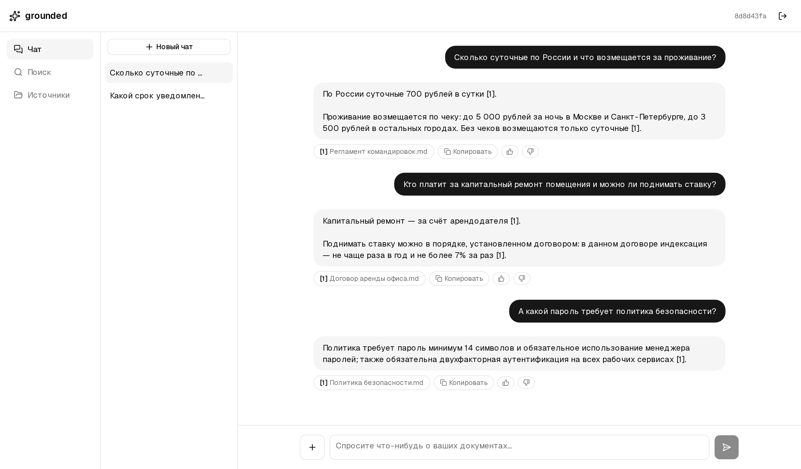
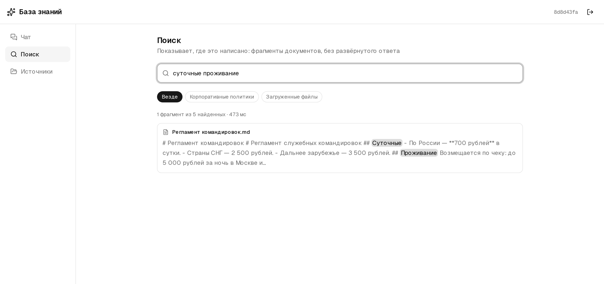
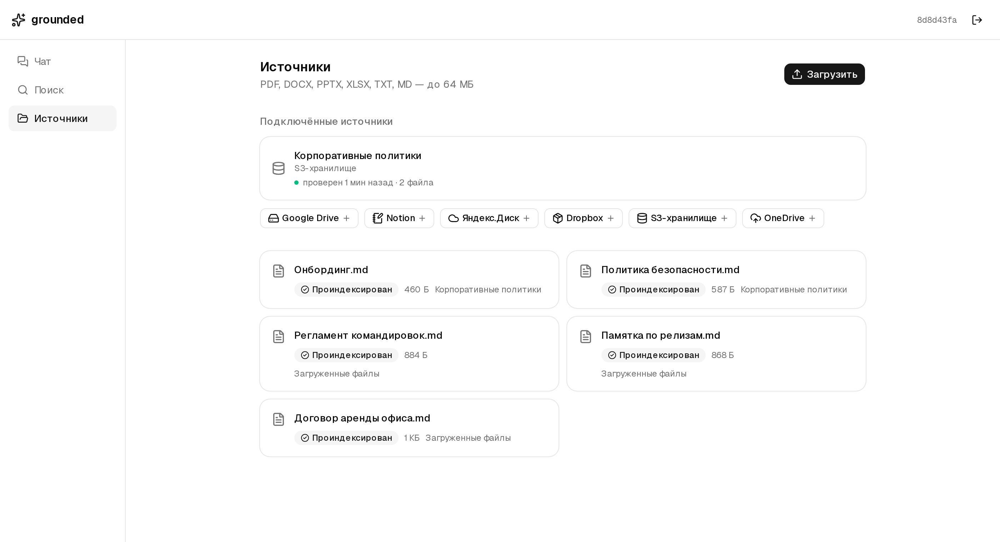
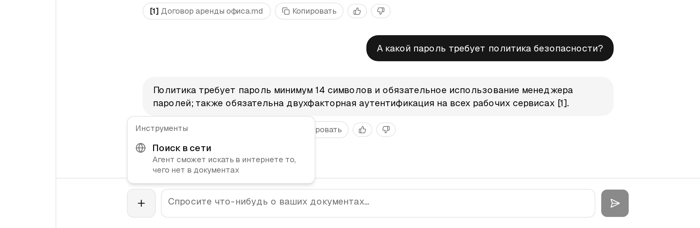
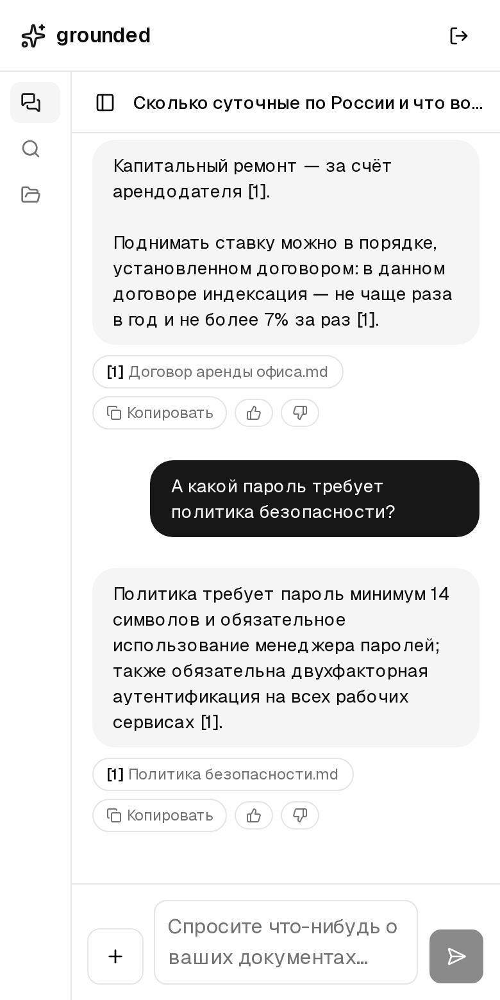
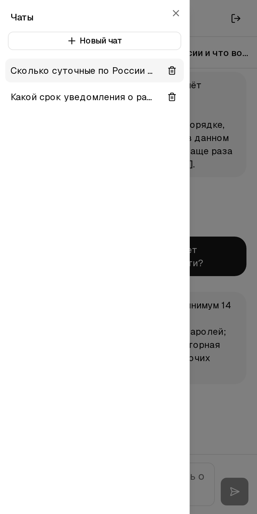

<h1 align="center">grounded</h1>

<p align="center">
  Личная база знаний, которая отвечает <b>только по вашим документам</b> —
  со ссылкой на конкретный файл и страницу, а не по памяти модели.<br>
  И честно говорит «этого здесь нет», когда сказать нечего.
</p>

<p align="center">
  <a href="https://github.com/work-meow/grounded/actions/workflows/build.yml"></a>
  
  
  
  
  
  
</p>



## Что это

Вы загружаете файлы или подключаете Google Drive, Notion, Dropbox, OneDrive,
Яндекс.Диск, любое S3-совместимое хранилище. Всё это непрерывно индексируется и
становится тем единственным, на что система опирается, когда отвечает.

Два режима, и они не заменяют друг друга. **Чат** отвечает своими словами и
ставит сноски — несколько секунд и немного токенов. **Поиск** отдаёт те же
фрагменты напрямую, с подсветкой совпадений: полсекунды. Первый отвечает на
вопрос, второй показывает, где это написано.

Внутри: гибридный поиск (векторы + BM25 с RRF), отбор релевантного отдельной
моделью, агент с ограниченным циклом переформулировок, опциональный поиск в
сети, живая переиндексация при изменении документов — и набор для оценки,
которым каждое из этих утверждений измерено.

## Как это выглядит

| Поиск | Источники |
|---|---|
|  |  |
| Из двадцати найденных индексом фрагментов показан один — тот, что действительно про запрос. Совпадения подсвечены, выдачу можно сузить до одного источника. | Подключённый источник сам говорит, когда его проверяли и сколько в нём файлов. Если токен отозвали на той стороне — скажет и это. |
| **Поиск в сети** | **На телефоне** |
|  |   |
| По кнопке и на конкретный разговор: агент идёт в интернет, когда в документах ответа нет, и нумерует найденное вместе с вашими фрагментами. | Тот же интерфейс: чат целиком и список чатов в выдвижной панели. |

## Что здесь сделано иначе

**Ответ «не знаю» — это факт, а не мнение модели.** Индекс — ранжирующий
ретривер: он возвращает k лучших фрагментов на любой запрос, подходящие они или
нет. Раньше модель получала восемь уверенных абзацев про другое и должна была
сама догадаться, что ни один не помогает. Теперь кандидатов читает отдельная
дешёвая модель — 0.3–0.7 с и $0.00017 за вызов. Замерено на тринадцати вопросах:

| | было | стало |
|---|---|---|
| нужный документ найден | 10/10 | 10/10 |
| фрагментов по делу | 24% | **82%** |
| документов в выдаче | 4.9 | **1.3** |
| на вопрос без ответа возвращается | 8.0 фрагментов | **0** |
| верных ответов | 13/13 | 13/13 |
| самый долгий ответ | 16.4 с | **4.4 с** |

**Качество измеряется, а не ощущается.** `backend/evals/` — тринадцать вопросов
и пять документов, которые лежат рядом. Прогон печатает полноту, точность и
долю верных ответов; вопрос без ответа проверяется по сноскам, потому что
сослаться не на что — значит, любая сноска указывает на то, что сказанного не
подтверждает.

**Живая индексация.** Файл, попавший в S3, ищется через пару секунд — без
перезапуска и очередей. Изменение в подключённом источнике подхватывается
следующим опросом и переиндексируется само.

**Чужие учётные данные запечатаны.** Токен подключённого источника шифруется
Fernet до того, как попасть в базу или в бакет, и не возвращается ни одним
эндпоинтом. Адрес S3-хранилища — единственное поле, где машину называет
пользователь, — резолвится и проверяется на то, что не ведёт внутрь частной
сети.

**Изоляция — на точном равенстве.** Поиск фильтруется по `user_id`, и в фильтр
подставляется объект `UUID`, а не строка: типизация здесь и есть защита от
инъекции.

**Всё это доступно из чужого кода — и говорит, сколько стоило.** `POST
/api/v1/answer` отвечает одним JSON или потоком, со сносками, шагами агента и
ценой запроса, собранной из того, что выставил провайдер за каждый вызов. Тот
же движок отвечает и в формате OpenAI, так что готовый SDK работает по одному
`base_url` — проверено официальным клиентом. Справочник лежит и внутри
приложения (внизу бокового меню — «Документация», с примерами, в которые уже
подставлен ваш хост), и здесь: [docs/api.md](docs/api.md).

## Как устроено

```
              браузер                    ваш код
                 │                          │
          Next.js + shadcn/ui      /api/v1 · формат OpenAI
                 │  JWT в cookie            │  JWT в Authorization
                 └───────────┬──────────────┘
                             ▼
                   FastAPI  ──────────────►  PostgreSQL
                      │                      users / sources / documents
                LangChain agent              chats / messages
                      │
             search_knowledge
             list_sources
             read_document
                      │
                      ▼
              Pathway  /v1/retrieve
        usearch KNN + tantivy BM25 → RRF
                      ▲
        ┌─────────────┴──────────────┐
       S3                    подключённые источники
  загруженные файлы     Drive · Notion · Dropbox · OneDrive
                        Яндекс.Диск · S3-совместимое хранилище
```

Два процесса, три внешних сервиса. Статус индексации нигде не дублируется — он
читается прямо из Pathway, поэтому двум источникам правды нечему разъезжаться.
Все коннекторы заканчиваются в одной раскладке метаданных, поэтому изоляция,
статус и цитаты работают для подключённых источников без правок ниже по стеку.

```
backend/    FastAPI, агент, PostgreSQL          собственный venv
indexer/    Pathway: коннекторы, парсинг,       собственный venv
            чанки, индекс
shared/     ключи, манифест, печать секретов    ставится в оба
frontend/   Next.js
```

Два virtualenv, а не один: `pathway[xpack-llm]` пинит `langchain<0.4`, а агенту
нужен `langchain>=1.0`. Процессы общаются по HTTP, поэтому дерево зависимостей
одного другому не нужно. Подробнее — [docs/design.md](docs/design.md).

## Быстрый старт

Нужны Python 3.13 (поставит сам `uv`), Node.js 22, PostgreSQL 14+,
S3-совместимое хранилище (AWS, R2, Backblaze, MinIO) и ключ
[OpenRouter](https://openrouter.ai) — он же для модели агента, он же для
эмбеддингов.

```bash
# база
createdb rag
psql rag -c "CREATE ROLE rag LOGIN PASSWORD 'rag'; GRANT ALL ON DATABASE rag TO rag;"

# конфигурация — у каждого файла есть шаблон рядом
cp backend/.env.example backend/.env
cp indexer/.env.example indexer/.env
cp frontend/.env.example frontend/.env.local

openssl rand -hex 32   # → JWT_SECRET в backend/.env
uv run --project backend python -c \
  "from rag_shared.crypto import generate_key; print(generate_key())"   # → SECRETS_KEY

# зависимости
cd backend  && uv sync && uv run alembic upgrade head
cd indexer  && uv sync
cd frontend && npm install
```

В обоих `.env` — одинаковые доступы к S3, `OPENROUTER_API_KEY` и один и тот же
`SECRETS_KEY`: API им запечатывает чужие токены, индексер открывает. Оставите
пустым — подключение источников отключится, загрузка файлов продолжит работать.

Три процесса, каждый в своём терминале:

```bash
cd indexer  && uv run python -m rag_indexer.pipeline          # первым: проверяет ключ на старте
cd backend  && uv run uvicorn app.main:app --reload --port 8000
cd frontend && npm run dev
```

Выпустите себе токен и войдите с ним на <http://localhost:3000>:

```bash
cd backend && uv run rag-token --email вы@example.com
```

Подключение источников, настройка Google Drive и деплой —
[docs/setup.md](docs/setup.md).

## Проверки

```bash
cd backend  && uv run pytest && uv run ruff check .
cd indexer  && uv run pytest && uv run ruff check .
cd frontend && npx tsc --noEmit && npx eslint . && npm run build
```

383 теста, и бьют они по тому, что ломается незаметно: изоляция пользователей
(на реальном JMESPath после переписывания, которое делает Pathway), нумерация
цитат, дифф опроса у коннекторов, отсутствие секретов в манифесте, курсор
пагинации, адрес объектного хранилища. Что именно и почему —
[docs/design.md](docs/design.md#что-проверяют-тесты).

## Ограничения

Осознанные упрощения помечены в коде комментарием `ponytail:` — там же назван
потолок и путь наверх.

- **Сканы не распознаются.** PDF без текстового слоя загрузится и пометится
  «Без текста», но в поиске не найдётся. OCR — это +200 МБ в образ и секунды на
  страницу.
- **Один документ индексируется не более чем на 8 млн символов** (~4000
  страниц). Без потолка файл на 64 МБ уводил индексер с 225 МБ до 1.7 ГБ.
- **Токен нельзя отозвать досрочно** — проверка подписи не ходит в базу, JWT
  действует до своего `exp`.
- **О сломавшемся источнике сообщается со следующей попытки опроса**: полминуты
  после неудачи, интервал обновления при штатной работе. Документы при этом
  остаются в поиске — сбой сети не должен выметать индекс.
- **Новый источник перезапускает индексер** (граф Pathway фиксируется при
  сборке): до 30 секунд на замечание и 6–7 на перезапуск, поиск в это время
  недоступен. Эмбеддинги заново не оплачиваются.
- **Список источников общий на весь деплой** — манифест переписывается целиком,
  поэтому два одновременных подключения могут перезаписать друг друга.
  Следующее изменение это чинит.
- **Dropbox и OneDrive требуют четыре поля**, включая refresh token: полноценный
  OAuth-редирект потребовал бы регистрации приложения и коллбэка.
- **История чата сжимается, а не обрезается**: последние 20 сообщений уходят
  модели целиком, пока укладываются в порог по токенам, и суммаризуются выше
  него.
- **Тело запроса ограничено 4 МБ**, загрузка — 64 МБ. FastAPI разбирает тело до
  проверки токена, поэтому потолок стоит раньше всего остального.
- **У API нет ограничения частоты запросов.** Один ход ограничен по числу
  вызовов и по времени; поток запросов — нет.
- **Смена модели эмбеддингов обнуляет индекс** — другое векторное пространство.

## Документация

- [docs/api.md](docs/api.md) — API: спросить, найти, загрузить; потоком или
  одним ответом; стоимость запроса; формат OpenAI.
- [docs/setup.md](docs/setup.md) — подключение источников, сервисный аккаунт
  Google, деплой.
- [docs/design.md](docs/design.md) — почему именно так: замеры, отвергнутые
  варианты, что проверяют тесты, как добавить свой коннектор, инструмент или
  формат.

## Лицензия

MIT — см. [LICENSE](LICENSE). Pathway распространяется под BSL 1.1: для личного
использования это не ограничение, но перед коммерческим запуском стоит
прочитать её Additional Use Grant.
